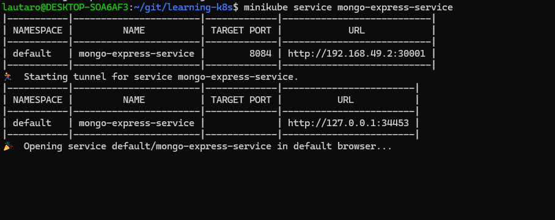
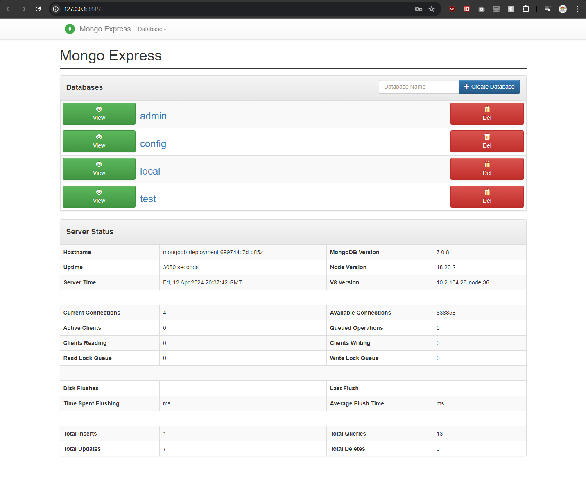
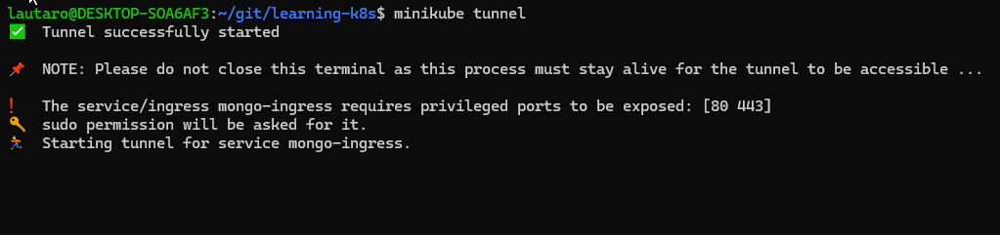

# learning-k8s

Repo I'm using to learn and experiment with the basics of Kubernetes in a local development environment.

## Service




## Ingress




## Namespaces

These provide a way to isolate groups of resources within a single cluster.
Resource names have to be unique within a namespace, but not across namespaces

### Default namespaces
Command: `kubectl get namespaces`

```logs
NAME              STATUS   AGE
default           Active   10h
kube-node-lease   Active   10h
kube-public       Active   10h
kube-system       Active   10h
```

#### `kube-system`
* Not meant to be interacted with
* System processes
* Master and Kubectl processes

#### `kube-public`
* Publicly accessidble data
* Has a config map that contains cluster information
    * i.e. `kubectl cluster-info`

#### `kube-node-lease`
* Info about hearbeats of nodes
* Lease object associated to each node in namespace
* Determines availability of each node

#### `default`
* Everything you create will default to this namespace

### Usage

#### Referencing resource from a different namespace

In the following ConfigMap `database_url` will point to `example-service` from `example-namespace`

```yml
apiVersion: v1
kind: ConfigMap
metadata:
  name: example-configmap
data:
  database_url: example-service.example-namespace
```

#### Defining namespace for a resource

##### Through CLI command
```sh
kubectl apply -f example-deployment.yml --namespace=example-namespace
``` 

##### Through configuration file metadata
```yml
apiVersion: v1
kind: ConfigMap
metadata:
  name: example-configmap
  namespace: example-namespace
data:
  database_url: example-service
```

#### Working with a specific namespace
`kubectl get all` will allways defer to the `default` namespace unless told otherwise with `-n namespace-name`.
There are tools like [`kubens`](https://github.com/ahmetb/kubectx) to have a more comfortable experience working with multiple namespaces

### Notes

* You usually can't share resources between namespaces. (i.e. each namespace will have to have their own `ConfigMap` to connect to a DB **even if** the config is the same)

* Some components are cluster-specific and can't be bound to a namespace (i.e. `Volumes` and `Nodes`)
