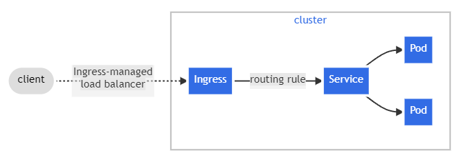

# learning-k8s

Repo I'm using to learn and experiment with the basics of Kubernetes in a local development environment.
For the purpose of simplicity this repo is using [mongo](https://hub.docker.com/_/mongo) and [mongo-express](https://hub.docker.com/_/mongo-express) docker images.


## Table of contents
- [Dependencies](#dependencies)
- [Pods](#pods)
- [Service](#service)
- [Ingress](#ingress)
- [Namespaces](#namespaces)

## Dependencies
* [Docker](https://www.docker.com/)
* [Minikube](https://minikube.sigs.k8s.io/)
* [Kubernetes and Kubectl](https://kubernetes.io/)

## Kubernetes

* Open source container orchestration tool
* Helps manage containerized applications in different environments.

## Pod
This are the smallest deployable unit in K8s and an abstraction layer over Containers.<br>
**Generally we do NOT create these directly, instead they are created by resources like `Deployments` or `Jobs`.**

### Notes

* Ephemeral (they can "die" easily)
* Usually 1 application per Pod
* Each pod gets their IP address (internal)

### Example
```yaml
apiVersion: v1
kind: Pod
metadata:
  name: mongodb
spec:
  containers:
  - name: mongodb
    image: mongo:6.0
    ports:
    - containerPort: 80
```

## Deployments
Declarative definition for `Pods` and `ReplicaSets`.
We can specify the desired:
* container image with the `.spec.template.spec.containers[n].image` attribute.
* number `Pods` with the `.spec.replicas` attribute
* environment variables with `.spec.template.spec.containers[n].env`

### Example
```yaml
apiVersion: apps/v1
kind: Deployment
metadata:
  name: mongodb-deployment
spec:
  replicas: 3 # default to 1
  selector:
    matchLabels:
      app: mongodb
  template:
    metadata:
      labels:
        app: mongodb
    spec:
      containers:
      - name: mongodb
        image: mongo # https://hub.docker.com/_/mongo
        ports:
        - containerPort: 27017
        env:
        - name: MONGO_INITDB_ROOT_USERNAME
          valueFrom:
            secretKeyRef: 
              name: mongodb-secret # secret name
              key: mongo-root-username # secret data key
        - name: MONGO_INITDB_ROOT_PASSWORD
          valueFrom:
            secretKeyRef:
              name: mongodb-secret # secret name
              key: mongo-root-password # secret data key

```

## Service
Basically a static/permanent IP address that can be attached to pods in the corresponding network.
Its lifecycle is not connected to the referenced Pods.<br>
The resulting url usually looks like this: `protocol://node-ip-address:port`.

### Example
```yaml
apiVersion: v1
kind: Service
metadata:
  name: mongodb-service
spec:
  selector:
    app: mongodb # spec.selector.matchLabels.app from Deployment template
  ports:
  - port: 27017
    targetPort: 27017
```

### Expose the service to the host machine with:
```sh
minikube service mongo-express-service
```


## Ingress
Manages external access to services in a cluster. It exposes HTTP/HTTPS routes from outside the cluster to services within it.



### Start a tunnel and use the correponding `host` in `Ingress` to access service:
```sh
minikube tunnel
```


## ConfigMap
Maps external configuration of your application

### Example
```yml
apiVersion: v1
kind: ConfigMap
metadata:
  name: mongo-configmap
data:
  database_url: mongodb-service
```

## Secret
Pretty much the same as ConfigMap but it is used to store secret data AND it is stored in base64 encoded format.

```yml
apiVersion: v1
kind: Secret
metadata:
  name: mongodb-secret
type: Opaque
data:
  mongo-root-username: dXNlcm5hbWU= # "username" base64 encoded
  mongo-root-password: cGFzc3dvcmQ= # "password" base64 encoded

```

## Namespaces

These provide a way to isolate groups of resources within a single cluster.
Resource names have to be unique within a namespace, but not across namespaces

### Default namespaces
Command: `kubectl get namespaces`

```logs
NAME              STATUS   AGE
default           Active   10h
kube-node-lease   Active   10h
kube-public       Active   10h
kube-system       Active   10h
```

#### `kube-system`
* Not meant to be interacted with
* System processes
* Master and Kubectl processes

#### `kube-public`
* Publicly accessidble data
* Has a config map that contains cluster information
    * i.e. `kubectl cluster-info`

#### `kube-node-lease`
* Info about hearbeats of nodes
* Lease object associated to each node in namespace
* Determines availability of each node

#### `default`
* Everything you create will default to this namespace

### Usage

#### Referencing resource from a different namespace

In the following ConfigMap `database_url` will point to `example-service` from `example-namespace`

```yml
apiVersion: v1
kind: ConfigMap
metadata:
  name: example-configmap
data:
  database_url: example-service.example-namespace
```

#### Defining namespace for a resource

##### Through CLI command
```sh
kubectl apply -f example-deployment.yml --namespace=example-namespace
``` 

##### Through configuration file metadata
```yml
apiVersion: v1
kind: ConfigMap
metadata:
  name: example-configmap
  namespace: example-namespace
data:
  database_url: example-service
```

#### Working with a specific namespace
`kubectl get all` will allways defer to the `default` namespace unless told otherwise with `-n namespace-name`.
There are tools like [`kubens`](https://github.com/ahmetb/kubectx) to have a more comfortable experience working with multiple namespaces

### Notes

* You usually can't share resources between namespaces. (i.e. each namespace will have to have their own `ConfigMap` to connect to a DB **even if** the config is the same)

* Some components are cluster-specific and can't be bound to a namespace (i.e. `Volumes` and `Nodes`)
